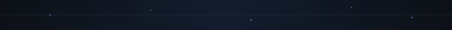

<!-- Banner animado (SVG con partículas + gradiente en movimiento) -->

  

### 🧠 Entre algoritmos y café, nace la magia.

- 🚀 En **[HieysoN](https://hieyson.com)** diseño ecosistemas digitales completos: aplicaciones web a medida, agentes de IA conversacionales y automatizaciones que hacen que los negocios trabajen solos.
- 🛠️ Mi stack principal: **React, Next.js, Node.js, Python, Django, PostgreSQL, MongoDB**.
- 🤖 Construyo agentes de IA (**RAG**), chatbots conversacionales y flujos de automatización con **n8n**.
- 🌱 Actualmente profundizando en **arquitecturas escalables** y **Cloud Computing**.
- 💬 Pregúntame sobre: **Python, React, Node.js, Django, MongoDB, PostgreSQL, IA aplicada**.
- 📫 Contacto profesional: **contacto@hieyson.com**
- 🌐 Portafolio y casos de éxito: **[hieyson.com](https://hieyson.com)**
- 🏠 Déjame un **👋** en Discord: [Nosyeih](https://discordapp.com/users/672302449209507842)

  <ul align="center">
    
<h2 style="display: inline-block">💼 Lo que construyo</h2>

  </ul>

<table align="center" width="100%">
<tr>
<td width="50%" valign="top">

**🖥️ Desarrollo de Software a Medida**
Aplicaciones rápidas, seguras y fáciles de usar. SPAs y plataformas interactivas sin distracciones.

**🤝 Agentes de IA y Chatbots**
Sistemas RAG conversacionales que atienden clientes, califican leads y venden 24/7.

</td>
<td width="50%" valign="top">

**⚙️ Automatizaciones (n8n)**
Conecto CRMs, correos, bases de datos y WhatsApp en flujos de trabajo que nunca fallan.

**📊 Sistemas B2B & Dashboards**
Portales de clientes y paneles administrativos complejos pero fáciles de entender.

</td>
</tr>
</table>

  <ul align="center">
    
<h2 style="display: inline-block">📊 Estadísticas & Trofeos</h2>

  </ul>

<table align="center">
<tr>
<td width="50%" align="center">
  
</td>
<td width="50%" align="center">
  
</td>
</tr>
</table>

  <ul align="center">
    
<h2 style="display: inline-block">🧩 Tecnologías & Herramientas</h2>

  </ul>

<b>Frontend</b>

  

<b>Backend</b>

  

<b>Bases de Datos</b>

  

<b>Agentes de IA & Automatización</b>

  
  
  
  
  

<b>DevOps & Cloud</b>

  
  
  

  <ul align="center">
    
<h2 style="display: inline-block">🤝 Contáctame</h2>

  </ul>

  
  
  
  
  
  

  <b>📩 contacto@hieyson.com</b> &nbsp;|&nbsp; <b>🌐 hieyson.com</b>

  

<i>Yo: <a href="https://github.com/Neve7s">Nosyeih</a> — 2026</i>

Última actualización: 08/07/2026

